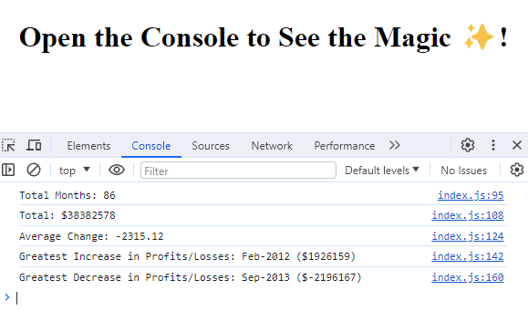

# Financial Data Analysis

## Overview

This JavaScript script analyzes financial data, providing key metrics such as total months, net total amount, average
change, greatest increase in profits, and greatest decrease in losses over a specific period.

## Preview



## Link to the Deployed Application

[https://volodymyr-shtyka.github.io/Console-Finances/](https://volodymyr-shtyka.github.io/Console-Finances/)

## Usage

1. Copy the provided financial data into a JavaScript file, e.g., `index.js`.
2. Create an HTML file, e.g., `index.html`, and include the following content:

```html
<!DOCTYPE html>
<html lang="en-gb">
<head>
  <meta charset="UTF-8">
  <meta http-equiv="X-UA-Compatible" content="IE=edge">
  <meta name="viewport" content="width=device-width, initial-scale=1.0">
  <title>M4 Challenge</title>
</head>
<body>
<h1 style="text-align:center;">Open the Console to See the Magic ✨! </h1>
<script src="index.js"></script>
</body>
</html>
```

3. Open the HTML file in a web browser and check the browser console for the analysis results.

## Financial Data

Modify the finances array in the `index.js` file to include your specific financial data.

```javascript
var finances = [
    // ... your financial data here ...
];
```

## Metrics

- Total Months: The total number of months included in the dataset.
- Net Total Amount: The net total amount of Profit/Losses over the entire period.
- Average Change: The average of the changes in Profit/Losses over the entire period.
- Greatest Increase in Profits: The greatest increase in profits (date and difference in amounts) over the entire
  period.
- Greatest Decrease in Losses: The greatest decrease in losses (date and difference in amounts) over the entire period.

## Example

Assuming your financial data is in `index.js`, open the `index.html` file in a browser, and view the console for the
calculated metrics.

```yaml
Total Months: 86
Total: $38382578
Average Change: $-2315.12
Greatest Increase in Profits/Losses: Feb-2012 ($1926159)
Greatest Decrease in Profits/Losses: Sep-2013 ($-2196167)
```

Feel free to customize the structure and content based on your preferences and additional information you'd like to
provide.